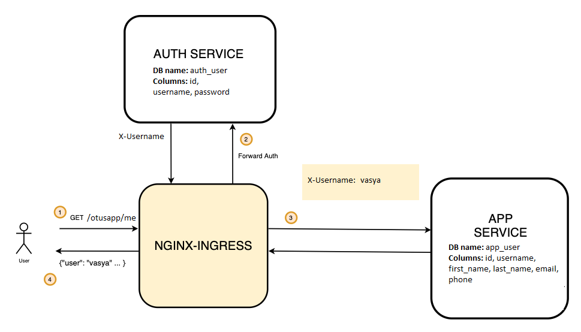

Архитектура решения

При регистрации пользователя (/register), сервис AUTH создает пользователя в локальной базе и отправляет REST запрос на создание пользователя(с указанным username) в БД сервиса APP.

# Deploy
namespace auth

kubectl apply -f auth/config.yaml -f auth/deployment.yaml -f auth/postgres.yaml -f auth/initdb.yaml -f auth/service.yaml -f auth/ingress.yaml -f app/config.yaml -f app/deployment.yaml -f app/postgres.yaml -f app/initdb.yaml -f app/service.yaml -f app/ingress.yaml
